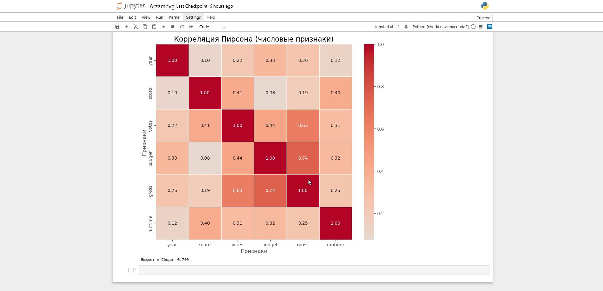

# Python-Anaconda-Project
Анализ Корреляций в Киноиндустрии: Python-Projekt.

Это самостоятельная учебная работа по анализу данных, вдохновленная туториалом Data Analyst Portfolio Project | Correlation in Python от AlexTheAnalyst. 

Проект посвящен исследованию корреляций между переменными в датасете о фильмах (Movie Dataset с Kaggle).

📊Рабочий процесс проекта:

🔹Загрузила и очистила данные о 9742 фильмах (включая бюджет, сборы, голоса, жанры и т.д.).

🔹Выявила ключевые корреляции, такие как связь между бюджетом, длительностью фильма и кассовыми сборами.

🔹Построила визуализации для наглядного представления результатов.

🎯 Цели проекта

Научиться находить корреляции между числовыми и категориальными переменными. Освоить data cleaning и визуализацию в Python. Подготовить готовый ноутбук для GitHub-портфолио.

🛠 Используемые инструменты и библиотеки

🔹IDE: Jupyter Notebook (через Anaconda). Библиотеки:

🔹pandas — для загрузки, очистки и манипуляции данными. numpy — для проверки пропусков. matplotlib — для базовых scatter plots. seaborn — для регрессионных графиков и heatmap'ов корреляций.

🔹Датасет: Movies Dataset (CSV-файл с данными о фильмах).

📊 Ключевые шаги анализа

🔹Загрузка данных: Чтение CSV с помощью pd.read_csv(). 

🔹Очистка:

Проверка и обработка пропусков (for-loop + NumPy). Изменение типов данных (budget и gross → int). Создание колонки с годом выпуска из даты релиза. Удаление дубликатов и сортировка по сборам.

🔹Анализ корреляций:

Scatter plots для пар переменных (budget vs. gross). Корреляционная матрица (методы: Pearson, Kendall, Spearman). Heatmap для визуализации. Преобразование категориальных колонок (genres, company) в числовые для включения в анализ.

Визуализация: Графики с Seaborn для выявления сильных связей (например, корреляция ~0.65 между бюджетом и сборами).

Пример результата: Корреляция между бюджетом и сборами — 0.65 (Pearson), что указывает на умеренную положительную связь. Фильмы с большим бюджетом чаще собирают больше! 📈 Результаты и insights

Топ-корреляции: Бюджет → Сборы (0.65), Голоса → Сборы (0.63), Длительность → Рейтинг (слабая, но положительная). Инсайты: Жанры вроде "Action" и "Adventure" коррелируют с высокими сборами, но требуют большего бюджета. 

